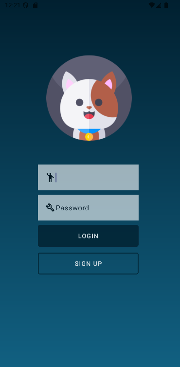
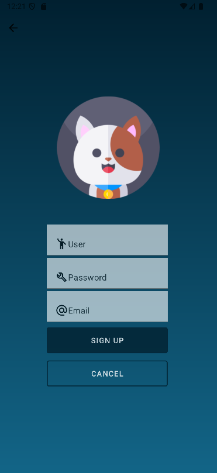

# INTRODUCCION
Pantalla del Login

Pantalla del Sign Up

# PROYECTO NICESTART
1- Se ha creado el proyecto Nicestart
2- Se ha creado dos Views, uno con el LoginActivity y otro con el SignUpActivity
3- Se ha conseguido que desde el Login se pueda ir al SignUp o al Main,
   y tambien que desde el SignUp se pueda ir al Login o al Main
4- Se ha creado la Rama Stack, exportado los estilos y temas
5- Se ha incluido el README.md con las imagenes en la rama Main
6- Finalizado